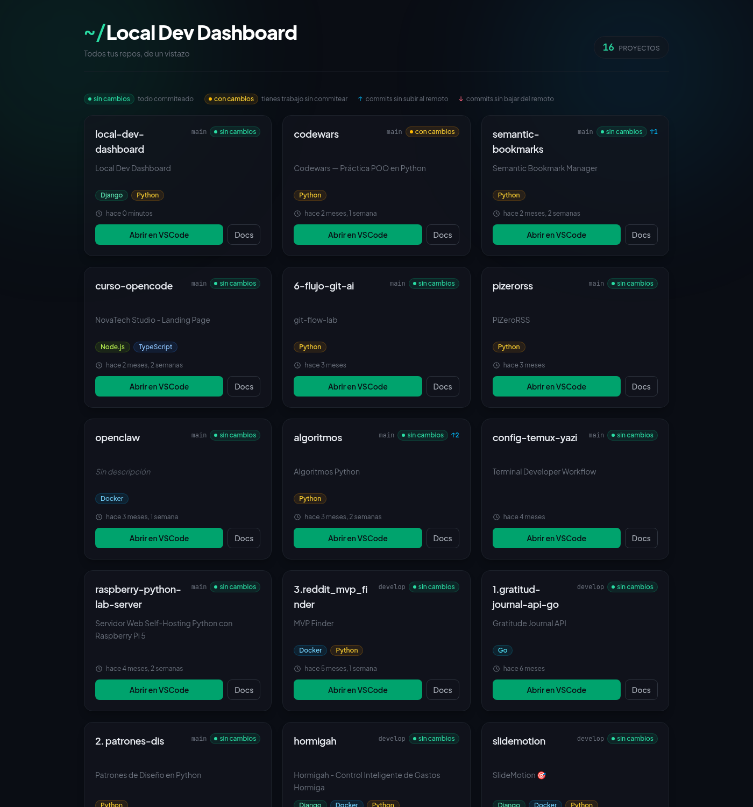
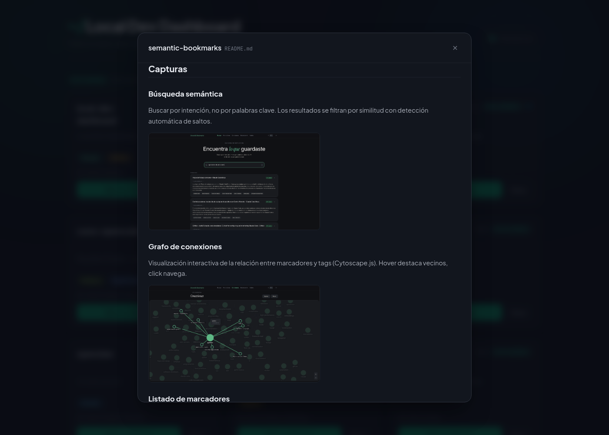

# Local Dev Dashboard

Panel de control web **local** para Linux que cataloga tus proyectos de código y muestra, de un
vistazo, cómo va cada uno: estado de Git, stack detectado, README y última actividad, con acciones
rápidas (abrir en VSCode, leer la documentación).

Es una herramienta **solo-local**: pensada para correr en `127.0.0.1` mientras trabajas, nunca para
desplegar a producción. Está pensada y probada **para Linux**.



## Qué hace

- **Escanea** la carpeta donde guardas tus proyectos (recursivamente, hasta 3 niveles) y detecta
  cualquier directorio que sea un repositorio Git.
- **Ordena por actividad**: lo más reciente arriba, los repos sin commits al final.
- **Detecta el stack** por ficheros marcadores (`pyproject.toml`, `package.json`, `go.mod`,
  `tsconfig.json`…) y, para repos sin fichero de proyecto, por los ficheros que contiene
  (`*.py`, `*.ipynb`, `*.csproj`). Se muestra como etiquetas con color por tecnología.
- **Estado de Git sin cachear**: rama, cambios sin confirmar y commits por delante/por detrás del
  remoto. Se calcula de cero en cada carga, y cada tarjeta lo pide vía HTMX al entrar en pantalla
  (no se refresca sola: lo que ves se congela hasta que recargas).
- **README en un modal**, renderizado de Markdown a HTML sin salir del panel, con las imágenes
  del propio repo como miniaturas ampliables al clic.
- **Abrir en VSCode** con un clic.

El botón "Docs" de cada tarjeta abre el README sin salir del panel:



## Requisitos

- **Linux** (es el único sistema en el que se ha probado; las rutas y la acción de abrir en VSCode
  asumen un entorno tipo Unix)
- Python 3.12+
- [`uv`](https://docs.astral.sh/uv/)
- `git` disponible en el `PATH`
- Opcional: el comando `code` en el `PATH` para la acción "Abrir en VSCode"

## Puesta en marcha

```bash
# 1. Dependencias (uv crea el entorno en .venv)
uv sync

# 2. Configuración: copia la plantilla y ajústala
cp .env.example .env
```

Edita el `.env` y ajusta al menos **`PROJECTS_ROOT`**, la carpeta raíz donde viven tus proyectos.
Admite `~` para tu home, así que vale cualquiera de estas:

```ini
PROJECTS_ROOT=~/Proyectos
PROJECTS_ROOT=~/code
PROJECTS_ROOT=/home/tu-usuario/dev
```

Opcionalmente, ajusta **`DASHBOARD_PORT`** (por defecto `8765`): el puerto en el que se sirve el
panel. Se usa un puerto distinto al `8000` de Django a propósito, para poder tener el dashboard
corriendo como segunda instancia sin chocar con otros proyectos.

Genera también tu propia `DJANGO_SECRET_KEY`:

```bash
uv run python -c "from django.core.management.utils import get_random_secret_key; print(get_random_secret_key())"
```

Después:

```bash
# 3. Base de datos
uv run python manage.py migrate

# 4. Arranca (compila Tailwind y sirve en DASHBOARD_PORT)
./run.sh
```

Abre <http://127.0.0.1:8765/> (o el puerto que hayas puesto en `DASHBOARD_PORT`).

`./run.sh` lee el puerto del `.env`, compila el CSS de Tailwind y arranca el servidor. Puedes
forzar un puerto puntual pasándolo como argumento: `./run.sh 9001`. Para **desarrollo activo** con
recompilación del CSS en vivo, usa en su lugar `uv run python manage.py tailwind runserver`.

> **No hace falta poblar el catálogo a mano.** El panel escanea `PROJECTS_ROOT` en cada carga de
> la página (cuesta ~0,1 s con 16 repos), así que la primera visita ya sale llena y un proyecto
> recién clonado aparece con solo recargar. El comando `sync_projects` sigue estando para
> sincronizar desde la terminal y es el único que puede **borrar** del catálogo, con `--prune`.

### Admin de Django

El admin estándar está en `/admin/` por si quieres inspeccionar o corregir el catálogo a mano.
Necesitas un usuario:

```bash
uv run python manage.py createsuperuser
```

Ten en cuenta que `sync_projects` es la fuente de verdad: lo que edites a mano se sobrescribe en la
siguiente sincronización.

## Comandos habituales

```bash
./run.sh                                      # arranca en DASHBOARD_PORT (compila CSS + server)
./run.sh 9001                                 # fuerza un puerto puntual
uv run python manage.py runserver             # servidor de desarrollo (sin watch de Tailwind)
uv run python manage.py tailwind runserver    # servidor + watch de Tailwind (recomendado en dev)
uv run python manage.py sync_projects         # escanea PROJECTS_ROOT y actualiza el catálogo
uv run python manage.py sync_projects --prune # además, borra del catálogo lo que ya no existe
uv run python manage.py sync_projects --root ~/otra-carpeta   # escanea otra raíz puntualmente
uv run pytest -x -v                           # tests
```

## Cómo está montado

Arquitectura por capas: `models` → `services` → `views` → `templates`/`partials` → `tests`.

```
apps/projects/
├── models.py            # catálogo persistido (nombre, ruta, stack, last_commit)
├── services/            # lógica de negocio, sin saber nada de HTTP
│   ├── discovery.py     # escaneo recursivo de PROJECTS_ROOT
│   ├── git.py           # estado y último commit (subprocess, solo lectura)
│   ├── stack.py         # detección de stack (ficheros marcadores + patrones)
│   ├── readme.py        # Markdown → HTML sanitizado (nh3)
│   └── catalog.py       # vuelca lo escaneado en SQLite
├── views.py             # CBV finas: orquestan services y devuelven partials
└── templates/projects/  # plantillas y partials HTMX
```

En SQLite solo vive el **catálogo**, que es lo que permite pintar la lista al instante. El estado
vivo de Git y el HTML del README se calculan al vuelo bajo demanda y **no** se guardan. La única
excepción deliberada es `last_commit`: se persiste porque el orden por actividad lo hace la base de
datos, y no se puede ordenar por un dato que se calcula al renderizar.

El README se sanitiza con `nh3` antes de mostrarlo: el panel escanea la carpeta donde clonas
repos de terceros, y el modal pinta HTML. "Es local" protege de la red, no de un repo con
`<script>` en su README.

Stack: Django 6 + HTMX (cada endpoint devuelve un partial, sin build de JavaScript),
Tailwind v4 vía `django-tailwind-cli` (binario standalone, sin Node) y SQLite.

Más detalle en [`docs/`](docs/): [arquitectura](docs/arquitectura.md),
[flujos HTMX](docs/flujos-htmx.md) y [modelo de datos](docs/modelo-datos.md). Las convenciones
del proyecto viven en [`.claude/.rules/`](.claude/.rules/).

## Tests

```bash
uv run pytest -x -v
uv run pytest apps/projects/tests/test_git.py
```

Las acciones que lanzan procesos del sistema (abrir VSCode) se prueban siempre con `subprocess`
mockeado; los tests nunca abren ventanas reales.

## Licencia

[MIT](LICENSE) © Jose Antonio Olmos Martinez
